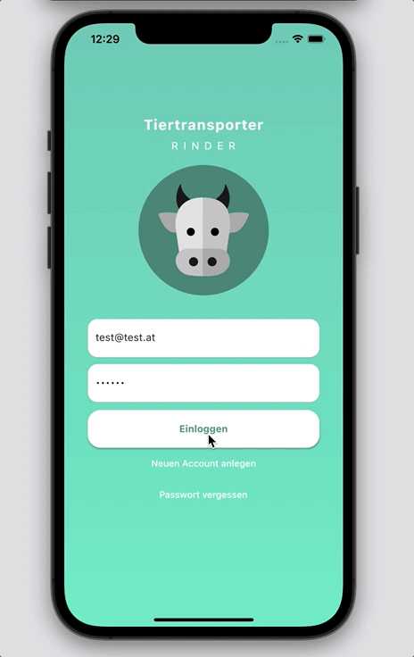
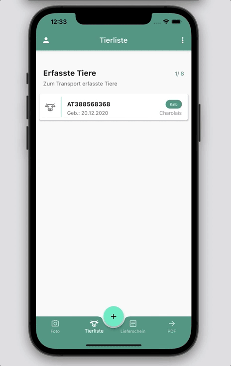
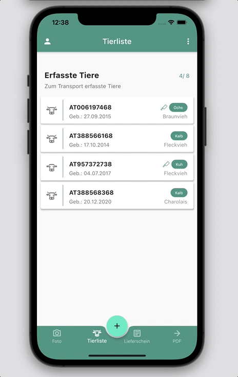
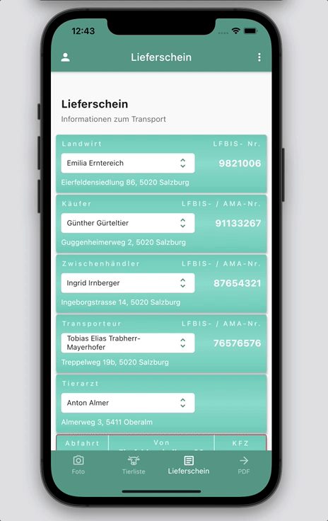
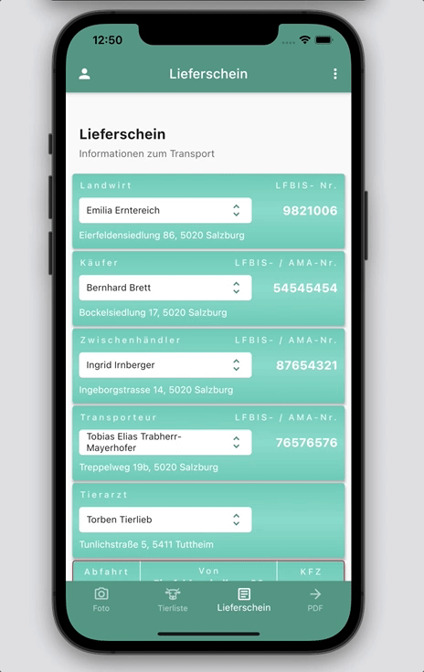

# Application to create delivery notes for cattles in Dart/Flutter

In Austria it is required to carry along a specific delivery note called Viehverkehrsschein
during the transportation of cattles. Such a document summarizes the relevant
data of the transported animals as well as further transportation details.
The focus of this thesis is to simplify and automate the process of producing such
an accompanying delivery note. It demonstrates the development of a smartphone
application for android and iOS devices, which aims at facilitating the
error-free and uncomplicated filling of the form. The function scope of the application
includes the extraction of cattle ear tag IDs from images by the use
of text recognition techniques and the fetching of animal data from a database.
Furthermore, information concerning the trading partners can be managed and
delivery notes can be shared and exported in PDF format. The application is
implemented in Dart and uses the mobile UI framework flutter.

## Important notes 

The following files have to be provided by you:
- For iOS Application: ios -> GoogleService-Info.plist (To connect iOS app with Firebase)
- For Android Application: android -> app -> google-service.json (To connect Android app with Firebase)
- Due to legal restrictions the form for the delivery note can not be provided. The created PDF will therefore differ from the PDF shown in the GIFs. 

## iOS Look and Feel

   
  
 

## Android Look and Feel

  
  
  
  
  
